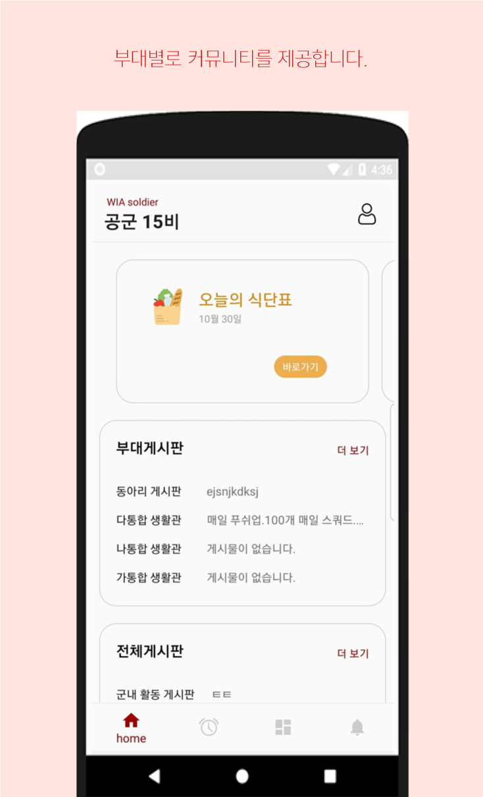
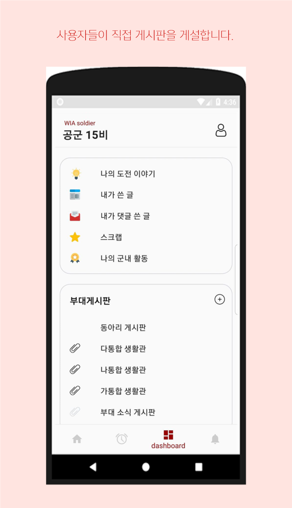
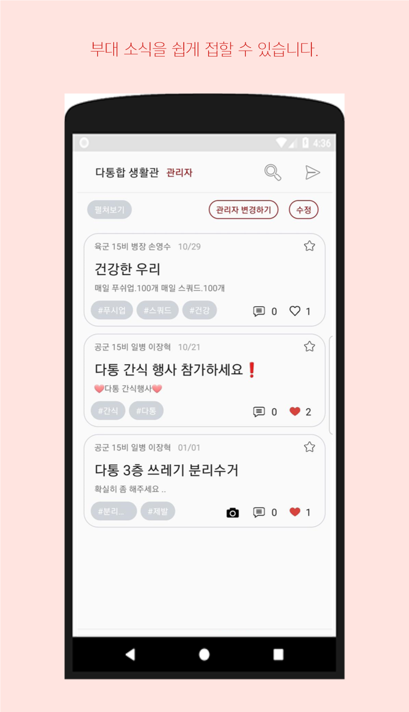
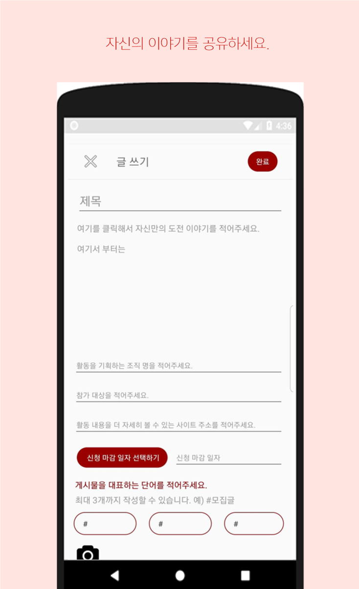
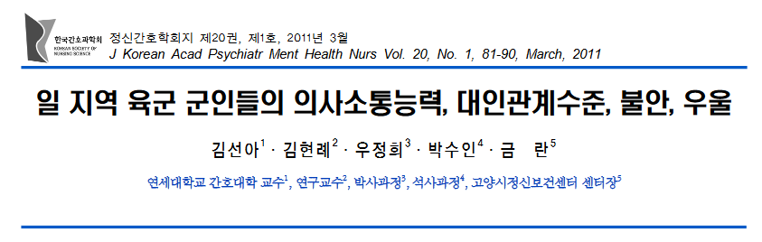
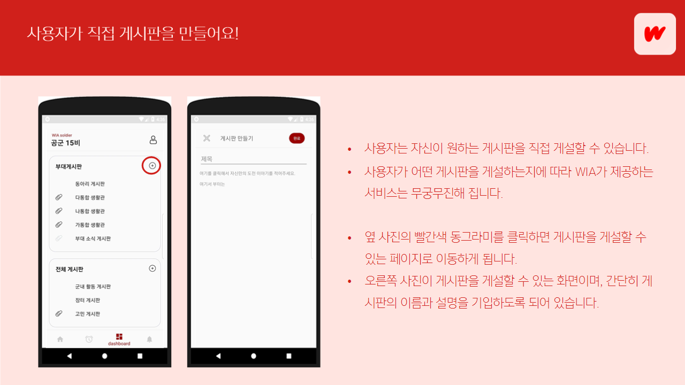
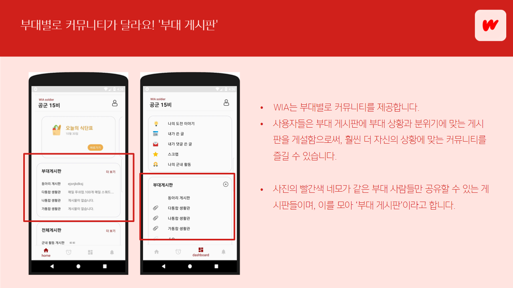
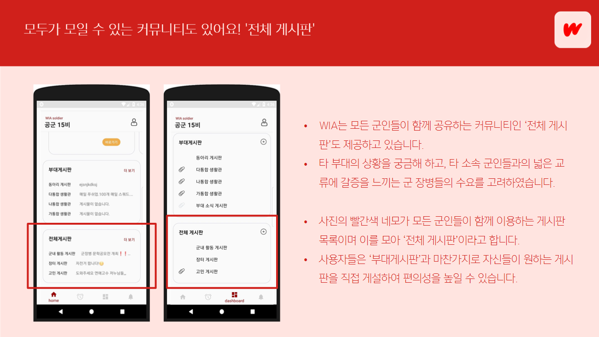

# 팀 로고


# What is WIA


WIA는 군에서 복무하는 장병들의 병영생활을 향상시키기 위해 기획된 종합 SNS 플랫폼입니다. WIA는 군인들의 커뮤니티 내 자유롭게 소통하여 서로의 지식을 나누고,
군 내부의 소식을 신속하고 편리하게 접할 수 있는 여러 서비스를 제공합니다.

## 1) 도입

 
 

4차 산업혁명과 함께 신속한 정보전달과, 개인과 개인 사이의 네트워크는 모든 분야에 필수적인 요건으로 자리잡고 있습니다. 실제로 인스타, 페이스북을 포함한
일상 SNS 부터, 여행객을 타겟팅한 '마이 리얼 트립', 대학생을 타겟팅한 '에브리타임' 등 특정 분야나 집단을 타겟팅한 SNS가 이미 다수 상용화 되어
우리의 삶 곳곳에서 편리함을 더해주고 있습니다. 그러나 타 집단에 비해, 상대적으로 높은 폐쇄성을 가진 '군대'라는 사회속에서 군인들을 위한 SNS는 쉽게
찾아볼 수 없었습니다.

**'아닌데! 군인과 곰신이 소통할 수 있는 카페도 있고, 특히 공군 같은 경우는 공군인끼리 소통할 수 있는 인트라넷 문학카페 '휴머니스트'도 있어요!!'**

맞습니다. 군인들을 위한 커뮤니티는 이미 다수 존재합니다. 그러나 저희는 군인들이 사용하는 커뮤니티 속에서 많은 불편한 점을 발견할 수 있었습니다.
정리하자면 다음과 같습니다.

### [군인들을 위한 커뮤니티의 문제점]

* 인트라넷을 기반으로 한 커뮤니티 같은 경우, 접근성이 매우 낮아 사용함에 불편함이 있습니다. 우선, 인트라넷이 사용 가능한 PC에서 접속을 해야 하는데
대개 인트라넷은 병사들이 자유시간을 즐기는 생활관에서는 사용할 수 없는 경우가 많습니다. 또한, 기본적으로 인트라넷 PC는 대부분이 업무용 PC이며,
사용시간 또한 일과시간인 경우가 많아, 병사들이 자유롭게 즐기기에 한계가 있습니다.

* 군대 내 특기 마다 인트라넷에 대한 접근성이 상이하여, 인트라넷 커뮤니티 내 교류 속에서 소외되는 병사들이 발생할 수 있습니다.
예를 들어, 헌병, 조리 특기 같은 경우, 업무에 있어 인트라넷 사용과 거리가 멀기 때문에 해당 특기의 병사들은 인트라넷을 자주 사용하지 못합니다.

* 대부분의 군인 커뮤니티는 군인만 사용하는 것이 아닌, 군인과 민간인이 함께 공유하기 때문에, SNS내 서비스가 군인들의 편리함에 집중되어 있지 않은 경우가 많습니다.
또한 민간인과 함께 사용할 경우, 보안에 민감한 군 사회의 특성상 군인들의 자유로운 의사 개진과 소통에 걸림이 많습니다.

* 현재 존재하는 군인 커뮤니티는 카페, 혹은 블로그 형식을 취하는 경우가 많습니다. 카페, 블로그 같은 경우 특유의 경직성 때문에 앱 기반 SNS 만큼의 자유로운 소통이 불가능합니다.
앱 기반 SNS의 장점은 간편하게 글을 게시하고, 실시간으로 타인의 글을 '매우 쉽게' 열람할 수 있는 것에 기인합니다. 그러나 카페, 블로그의 소통 방식과 UI 디자인으로는 앱 기반
SNS 만큼의 자유로움을 제공할 수 없습니다.

### 그럼 군인들을 위한 SNS가 왜 지금까지 안나왔나요?

* 병사들에게 군 부대 내 자유로운 핸드폰 사용이 비교적 최근에 허가되었기 때문입니다. SNS가 한 집단에 자리잡기 위해서는, 기본적으로 예비 사용자들의 자유로운 통신 수단 사용이
전제되어야 하는데, 군 부대 내에서는 이러한 기본적인 환경이 최근에 정착하여, SNS를 포함한 소통 플랫폼이 많이 미흡한 편입니다.

* 보안에 민감한 군 부대의 특성 상 일반 사설 업체가 군 부대내 SNS 서비스를 제공하기에는 한계가 있습니다.

* 군대의 폐쇄성에 의해 일반 사설 업체가 '군대'라는 집단의 특성을 분서하고 타겟팅하는 데에는 어려움이 있습니다.

### 군인에게 소통은 중요해요.



▶ [논문 링크](https://www.jkpmhn.org/upload/pdf/jkapmhn-20-81.pdf)

군인들에게 소통은 매우 중요한 요소입니다. 군대 내 고질적인 문제로 여겨졌던 병사


### 그래서 우리는 결정했어요!

위해서도 언급했듯이, 


## 2) 제공하는 서비스와 주요 기능

### 사용자가 직접 게시판을 만들어요!



WIA의 가장 큰 특징 중 하나는 사용자들이 직접 자신들이 원하는 게시판을 게설할 수 있다는 점입니다. 사용자들의 취향에 따라, 혹은 편의에 따라
직접 게시판을 만들 수 있습니다. 이러한 기능을 통해 WIA가 제공하는 서비스는 사용자의 편의에 따라 무궁무진해 집니다. 만약 사진을 좋아하는
사용자들이 사진 모임을 만들고 싶으면 '사진 게시판'을 게설하면 되며, 영화를 좋아하는 사용자들이 영화 모임을 만들고 싶으면 '영화 게시판'을 게설하면
됩니다. 이렇듯, WIA는 커뮤니티내 사용자들의 자율성을 최대한 보장하도록 개발되었습니다.

### 부대별로 커뮤니티가 달라요! '부대 게시판'



군대에는 너무도 많은 부대들이 있으며, 각 부대마다 상황과 분위기의 차이가 있습니다. 따라서 모든 군인들에게 오직 하나의 통합된 커뮤니티를 제공한다면,
사용자들 끼리의 공감대가 잘 형성되지 않을 수 있습니다. 예를 들어 공군 소속 병사가 '부대 내 비행기 소음에 따른 고충'에 관한 글을 올렸다고 가정했을 떄,
공군이 아닌 타군 병사들이 이 글을 읽고 공감하기는 힘들 것입니다.

따라서 WIA는 부대 별로 커뮤니티를 제공합니다. 사용자가 공군 교육사 소속이면, 교육사 소속 병사들 끼리, 15비 소속이면
15비 소속 병사끼리만 사용하는 게시판들이 있으며 이를 모아 '부대 게시판'이라고 합니다. 사용자들은 부대게시판에 직접 자신들이 원하는 게시판을 게설하여
편의성을 높일 수 있습니다. 각 부대별로 다른 커뮤니티를 제공하며, 사용자들이 각 커뮤니티 내에 부대 상황에 맞는 게시판을 게설함으로서, 사용자들은 훨씬 더
자신의 상황에 맞는 서비스를 제공 받을 수 있게 됩니다.

### 모두가 모일 수 있는 커뮤니티도 있어요! '전체 게시판'



공감대 형성도 중요하지만, 실제로는 만나기 어려운 사람들과 가상 공간에서 쉽게 소통할 수 있다는 것 또한 SNS의 큰 강점 중 하나입니다.
저희 팀은 많은 군인들이 타 군, 혹은 타 부대의 상황을 궁금해 하며, 같은 부대가 아닌 다른 소속 군인들과의 교류에 대한 갈증을 가지고 있다는 점을
발견하였습니다.

> "요즘은 같은 특기를 가진 사람들 끼리 같은 생활관을 쓰잖아.  
> 그러다 보니 다른 특기 사람들을 만날 일이 너무 없어. 그게 아쉽더라."

위 대사는 군 생활 중 동기와 선임들에게 종종 들을 수 있었던 말 중 하나였으며, 실제로 많은 군인들이 활발하고 넓은 교류에 목말라 하고 있습니다.

저희는 이러한 군인들의 수요에 맞추어 모든 군인들이 함께 사용하는 게시판들도 제공하며, 이러한 게시판들을 모아 '전체 게시판'이라고 합니다.
부대게시판과 마찬가지로 사용자들이 직접 원하는 게시판을 게설하여 사용자들이 원하는 서비스를 제공받을 수 있습니다.

### 우리 부대에는 어떤 동아리가 있을까?


## 팀소개 및 프로잭트 설명 동영상
[](https://www.youtube.com/watch?time_continue=117&v=LjX3eVQdIyk)

## 기능 설계
 -  발사믹, 카카오 오븐 등 본인이 편한 목업 프레임워크를 이용하여 제작 후 링크 
 - 수기로 작성시 찍어서 올려주세요

## 컴퓨터 구성 / 필수 조건 안내 (Prerequisites)
* ECMAScript 6 지원 브라우저 사용
* 권장: Google Chrome 버젼 77 이상

## 기술 스택 (Technique Used) (예시)
### Server(back-end)
 - Firebase를 활용한 DB, 서버 구현
 - 기타 자바 언어
 
### front-end
 - android (자바 기반)
 - XML
 - 기타 사용한 라이브러리

## 설치 안내 (Installation Process)
```bash
$ git clone git주소
$ yarn or npm install
$ yarn start or npm run start
```

## 프로젝트 사용법 (Getting Started)
**마크다운 문법을 이용하여 자유롭게 기재**

잘 모를 경우
구글 검색 - 마크다운 문법
[https://post.naver.com/viewer/postView.nhn?volumeNo=24627214&memberNo=42458017](https://post.naver.com/viewer/postView.nhn?volumeNo=24627214&memberNo=42458017)

 편한 마크다운 에디터를 찾아서 사용
 샘플 에디터 [https://stackedit.io/app#](https://stackedit.io/app#)
 
## 팀 정보 (Team Information)
- 이승준 (9penguin9@naver.com), Github Id: 0nandon
- 홍수성 (joseph1999@naver.com), Github Id: PnDong

## 저작권 및 사용권 정보 (Copyleft / End User License)
 * [MIT](https://github.com/osam2020-WEB/Sample-ProjectName-TeamName/blob/master/license.md)
