## 팀소개 및 프로잭트 설명 동영상

* 열악한 촬영 장소와 장비로 인해 매끄러운 발표를 진행하지 못한 점 양해 부탁드립니다.

* 유뷰트 화질이 좋지 않아 불편함을 느끼신다면, 아래 링크에서 발표 자료를 함께 참고해주시면 감사하겠습니다.

▶ [WIA_발표자료_show](https://github.com/osamhack2020/APP_WIA_ONANDON/blob/master/PPT/WIA_%EB%B0%9C%ED%91%9C.show)  
▶ [WIA_발표자료_pdf](https://github.com/osamhack2020/APP_WIA_ONANDON/blob/master/PPT/WIA_%EB%B0%9C%ED%91%9C.pdf)

# 팀 로고

WIA는 'we are'의 줄임말로, WIA 커뮤니티 내 자유로운 소통과 함께 군대 내에서도 건전한 자아실현을 이루었으면 하는 저희 팀의 작은 소망이 담긴 앱 이름입니다.
로고는 알파벳 W를 의미하며, 직접 글씨로 쓴듯하면서도 몽글몽글한 W 이미지를 통해 SNS의 가장 큰 매력인 자율성을 표현하고자 했습니다.

# What is WIA

WIA는 군에서 복무하는 장병들의 병영생활을 향상시키기 위해 기획된 종합 SNS 플랫폼입니다. WIA는 군인들의 커뮤니티 내 자유롭게 소통하여 서로의 지식을 나누고,
군 내부의 소식을 신속하고 편리하게 접할 수 있는 여러 서비스를 제공합니다.

## 1) 도입

 
 

4차 산업혁명과 함께 신속한 정보전달과, 개인과 개인 사이의 네트워크는 모든 분야에 필수적인 요건으로 자리잡고 있습니다. 실제로 인스타, 페이스북을 포함한
일상 SNS 부터, 여행객을 타겟팅한 '마이 리얼 트립', 대학생을 타겟팅한 '에브리타임' 등 특정 분야나 집단을 타겟팅한 SNS가 이미 다수 상용화 되어
우리의 삶 곳곳에서 편리함을 더해주고 있습니다. 그러나 타 집단에 비해, 상대적으로 높은 폐쇄성을 가진 '군대'라는 사회속에서 군인들을 위한 SNS는 쉽게
찾아볼 수 없었습니다.

**'아닌데! 군인과 곰신이 소통할 수 있는 카페도 있고, 특히 공군 같은 경우는 공군인끼리 소통할 수 있는 인트라넷 문학카페 '휴머니스트'도 있어요!!'**

맞습니다. 군인들을 위한 커뮤니티는 이미 다수 존재합니다. 그러나 저희는 군인들이 사용하는 커뮤니티 속에서 많은 불편한 점을 발견할 수 있었습니다.
정리하자면 다음과 같습니다.

### [군인들을 위한 커뮤니티의 문제점]

* 인트라넷을 기반으로 한 커뮤니티 같은 경우, 접근성이 매우 낮아 사용함에 불편함이 있습니다. 우선, 인트라넷이 사용 가능한 PC에서 접속을 해야 하는데
대개 인트라넷은 병사들이 자유시간을 즐기는 생활관에서는 사용할 수 없는 경우가 많습니다. 또한, 기본적으로 인트라넷 PC는 대부분이 업무용 PC이며,
사용시간 또한 일과시간인 경우가 많아, 병사들이 자유롭게 즐기기에 한계가 있습니다.

* 군대 내 특기 마다 인트라넷에 대한 접근성이 상이하여, 인트라넷 커뮤니티 내 교류 속에서 소외되는 병사들이 발생할 수 있습니다.
예를 들어, 헌병, 조리 특기 같은 경우, 업무에 있어 인트라넷 사용과 거리가 멀기 때문에 해당 특기의 병사들은 인트라넷을 자주 사용하지 못합니다.

* 대부분의 군인 커뮤니티는 군인만 사용하는 것이 아닌, 군인과 민간인이 함께 공유하기 때문에, SNS내 서비스가 군인들의 편리함에 집중되어 있지 않은 경우가 많습니다.
또한 민간인과 함께 사용할 경우, 보안에 민감한 군 사회의 특성상 군인들의 자유로운 의사 개진과 소통에 걸림이 많습니다.

* 현재 존재하는 군인 커뮤니티는 카페, 혹은 블로그 형식을 취하는 경우가 많습니다. 카페, 블로그 같은 경우 특유의 경직성 때문에 앱 기반 SNS 만큼의 자유로운 소통이 불가능합니다.
앱 기반 SNS의 장점은 간편하게 글을 게시하고, 실시간으로 타인의 글을 '매우 쉽게' 열람할 수 있는 것에 기인합니다. 그러나 카페, 블로그의 소통 방식과 UI 디자인으로는 앱 기반
SNS 만큼의 자유로움을 제공할 수 없습니다.

### 그럼 군인들을 위한 SNS가 왜 지금까지 안나왔나요?

* 병사들에게 군 부대 내 자유로운 핸드폰 사용이 비교적 최근에 허가되었기 때문입니다. SNS가 한 집단에 자리잡기 위해서는, 기본적으로 예비 사용자들의 자유로운 통신 수단 사용이
전제되어야 하는데, 군 부대 내에서는 이러한 기본적인 환경이 최근에 정착하여, SNS를 포함한 소통 플랫폼이 많이 미흡한 편입니다.

* 보안에 민감한 군 부대의 특성 상 일반 사설 업체가 군 부대내 SNS 서비스를 제공하기에는 한계가 있습니다.

* 군대의 폐쇄성에 의해 일반 사설 업체가 '군대'라는 집단의 특성을 분석하고 타겟팅하는 데에는 어려움이 있습니다.

### 군인에게 소통은 중요해요.
*#군인에게도 군인만의 SNS가 필요한 이유*

▶ [논문 링크](https://www.jkpmhn.org/upload/pdf/jkapmhn-20-81.pdf)

군인들에게 소통은 매우 중요한 요소입니다. 군대 내 고질적인 문제로 여겨졌던 부대 내 병사 우울증과 자살율은 대체적으로
소통의 부재에 따른 소외감과, 외로움에 기인하는 경우가 많습니다. 아래 문장들은 위 논문에서 발췌한 글로, 군인들의 우울함과 의사소통의 부재에 대한
상관관계를 알 수 있습니다.

> 국내 연구에 의하면 최근 들어 군생활의 물리적, 사회적 환경이 예전에 비해 크게 개선된 것으로 알려져 있으나 신세대 군인의 정신건강에 대한 주요 영향 요인으로 신체구타 및 인격모독, 세대차, 사생활 제한, 의사소통 만족도인 것으로 나타나 규율 밖에서 여위히 군대 내 의사소통 및 대인관계적인 부정적 요소가 존재함을 알 수 있었다.

> 본 연구결과 우울 성향을 가진 군인들의 우울에 영향을 미치는 변인들은 불안과 친구나 동료들과의 친밀감이었다.

위 발췌문에서 알 수 있듯이, 군인들의 부정적 심리 상태에 가장 많은 영향을 주는 요인 중 하나는 소통의 부재 및 친밀감 결여인 것으로 나타났습니다.
이외에도 의사소통의 부재와 심리적 우울증과의 상관관계에 대한 사례를 쉽게 찾아 볼 수 있었으며, 아래 기사는 그 중 하나를 예시로 발췌한 것입니다.

▶ [정신과 진료 받은 군인 4년 새 30% 늘었다](https://www.hankookilbo.com/News/Read/A2020102614370005022)

> 진료 환자의 진단명은 지난달 기준 '적응장애'가 가장 많았고, ...

이렇듯, 이미 병사들간의 건강한 교류를 돕고, 활발한 의사소통을 장려할 수 있는 신개념 커뮤니티의 필요성은 이미 오래전부터 대두되어왔습니다.

### 그래서 우리는 결정했어요!

자기중심적이고, 개성을 추구하는 신세대에게는 수직적 계급 제도가 존재하는 군대 내 생활이 다소 어색하게 느껴질 것이며, 이러한 상황속에서 오는
스트레스는 병사들의 소통 능력을 경직시킵니다. 따라서 저희는 병사들의 부대 생활 적응을 돕고, 병사들 사이의 의사소통을 활발히 하여 모든 군인들이
건강한 심리상태와 함께 건전한 병영생활을 이어나갈 수 있는 SNS 플랫폼을 기획하였습니다. 아래 목록은 WIA를 기획함에 있어 저희 팀이 목표로 하는 몇 가지 요소들을
정리한 것입니다.

* 군인이 사용하기에 적합해야 하며, 서비스의 기능이 군 문화에 특화될 것

* 군인이 사용함에 있어 높은 접근성을 구축하여, 기존의 군인 커뮤니티의 한계성을 탈피할 것

* 고정된 서비스를 제공하기 보다는 사용자들이 자신들의 편의에 따라 자유롭게 커뮤니티를 구축해 나감으로써, 최대한 자율성을 보장할 것

* 커뮤니티 내 건전한 이용 문화 확산 및 군인 SNS 이용 수칙을 강조하여 군법 위반 및 보안과 관련하여 우려되는 상황이 발생하지 않도록 설계할 것

## 2) 제공하는 서비스와 주요 기능

### 사용자가 직접 게시판을 만들어요!

WIA의 가장 큰 특징 중 하나는 사용자들이 직접 자신들이 원하는 게시판을 게설할 수 있다는 점입니다. 사용자들의 취향에 따라, 혹은 편의에 따라
직접 게시판을 만들 수 있습니다. 이러한 기능을 통해 WIA가 제공하는 서비스는 사용자의 편의에 따라 무궁무진해 집니다. 만약 사진을 좋아하는
사용자들이 사진 모임을 만들고 싶으면 '사진 게시판'을 게설하면 되며, 영화를 좋아하는 사용자들이 영화 모임을 만들고 싶으면 '영화 게시판'을 게설하면
됩니다. 이렇듯, WIA는 커뮤니티내 사용자들의 자율성이 최대한 보장되도록 개발되었습니다.

---

### 부대별로 커뮤니티가 달라요! '부대 게시판'

군대에는 너무도 많은 부대들이 있으며, 각 부대마다 상황과 분위기의 차이가 있습니다. 따라서 모든 군인들에게 오직 하나의 통합된 커뮤니티를 제공한다면,
사용자들 끼리의 공감대가 잘 형성되지 않을 수 있습니다. 예를 들어 공군 소속 병사가 '부대 내 비행기 소음에 따른 고충'에 관한 글을 올렸다고 가정했을 떄,
공군이 아닌 타군 병사들이 이 글을 읽고 공감하기는 힘들 것입니다.

따라서 WIA는 부대 별로 커뮤니티를 제공합니다. 사용자가 공군 교육사 소속이면, 교육사 소속 병사들 끼리, 15비 소속이면
15비 소속 병사끼리만 사용하는 게시판들이 있으며 이를 모아 '부대 게시판'이라고 합니다. 사용자들은 부대게시판에 직접 자신들이 원하는 게시판을 게설하여
편의성을 높일 수 있습니다. 각 부대별로 다른 커뮤니티를 제공하며, 사용자들이 각 커뮤니티 내에 부대 상황에 맞는 게시판을 게설함으로서, 사용자들은 훨씬 더
자신의 상황에 맞는 서비스를 제공 받을 수 있게 됩니다.

---

### 모두가 모일 수 있는 커뮤니티도 있어요! '전체 게시판'

공감대 형성도 중요하지만, 실제로는 만나기 어려운 사람들과 가상 공간에서 쉽게 소통할 수 있다는 것 또한 SNS의 큰 강점 중 하나입니다.
저희 팀은 많은 군인들이 타 군, 혹은 타 부대의 상황을 궁금해 하며, 같은 부대가 아닌 다른 소속 군인들과의 교류에 대한 갈증을 가지고 있다는 점을
발견하였습니다.

> "요즘은 같은 특기를 가진 사람들 끼리 같은 생활관을 쓰잖아.  
> 그러다 보니 다른 특기 사람들을 만날 일이 너무 없어. 그게 아쉽더라."

위 대사는 군 생활 중 동기와 선임들에게 종종 들을 수 있었던 말 중 하나였으며, 실제로 많은 군인들이 활발하고 넓은 교류에 목말라 하고 있습니다.

저희는 이러한 군인들의 수요에 맞추어 모든 군인들이 함께 사용하는 게시판들도 제공하며, 이러한 게시판들을 모아 '전체 게시판'이라고 합니다.
부대게시판과 마찬가지로 사용자들이 직접 원하는 게시판을 게설하여 사용자들이 원하는 서비스를 제공받을 수 있습니다.

---

### 우리 부대에는 어떤 동아리가 있을까?

부대 상황에 따라 약간의 차이는 있으나, 대부분의 부대에는 병사들의 건전한 문화생활과, 활발한 교류를 돕기 위해 병사들이 운영하는 동아리가 게설되어 있습니다.
문제는, 이러한 동아리에 대한 일반 병사의 접근성이 매우 낮다는 것이며, 대부분이 이름만 존재하거나 소극적인 활동만 간간히 이어나가고 있다는 것입니다. 
이유는 다음과 같습니다.

* 군대 내 수직적인 계급문화에 의해, 신병을 포함한 계급이 낮은 병사들이 선뜻 동아리에 지원하는데 어려움을 겪고 있습니다.

* 동아리에 대한 내용은 인트라넷 홈페이지에 게설되어 있는 경우가 많은데, 업무 상 인트라넷을 사용할 일이 거의 없는 특기 병사들은
사실상 동아리 정보를 접할 수 있는 기회가 없습니다.

* 부대 내 동아리 정보를 얻을 수 있는 경로가 부족하며, 홍보 문화 또한 미약한 경우가 많습니다.

WIA는 이러한 문제를 해결하고, 부대 내 동아리 문화의 확산과 동시에, 모든 장병들이 동아리 활동 내용을 쉽게 접할 수 있도록 '부대 게시판'내에
'동아리 게시판'을 게설하여 서비스를 제공하고 있습니다.

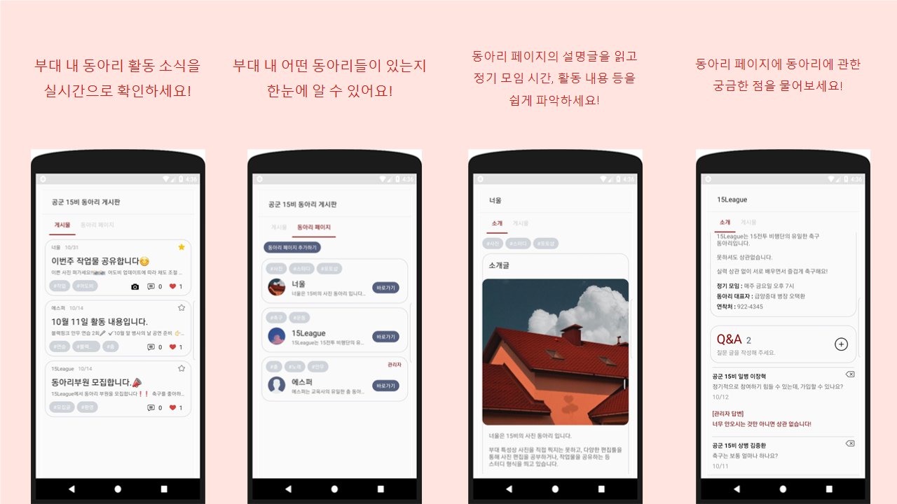

* 동아리 게시판은 사용자의 자대에서 게설된 동아리들의 활동 소식과 동아리 문화에 대한 전반적인 정보를 교류하는 게시판입니다. 

* 동아리 게시판에는 각 동아리들이 올린 사진, 내용을 포함하여 동아리 활동에 관한 다양한 글들이 모두 올라옵니다. 사용자들은 이러한 글을 실시간으로 확인함으로써,
부대 내 동아리에 대한 정보를 보다 쉽게 얻을 수 있을 것입니다.

* 동아리 마다, 동아리 전용 페이지가 있는데, 각 동아리 전용 페이지에는 동아리에 대한 간단한 설명글과 궁금한 점을 물어볼 수 있는 질문 게시판이 있습니다. 동아리 마다 부여되는
전용 페이지와 질문글 기능은 부대 내 동아리 문화 활성화에 큰 기여를 할 것입니다. 사용자는 원하면 새로 동아리 페이지를 생성할 수 있으며, 원하는 동아리가 부대 내 없을 경우
직접 동아리를 생성하여, 부원을 모집할 수 있습니다. 

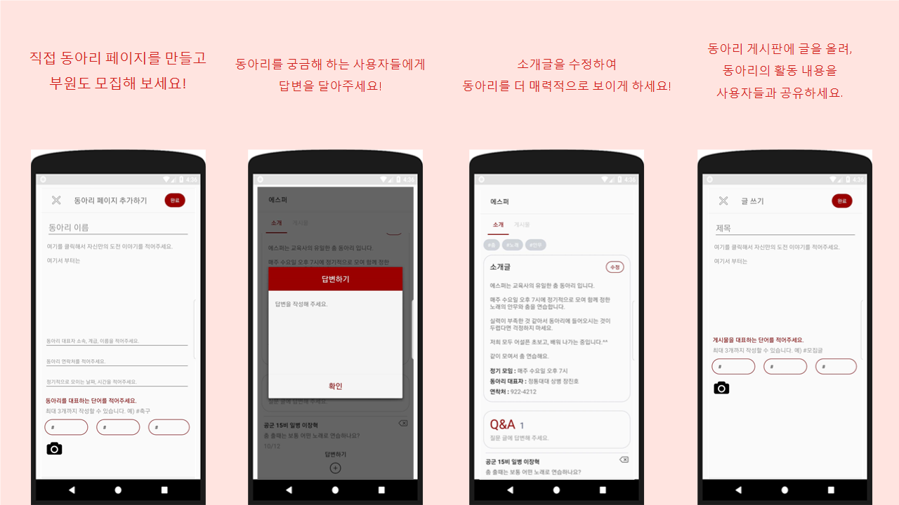

* 사용자가 동아리를 만들기 위해 새로 페이지를 개설하는 경우, 처음 페이지를 개설한 사용자가 그 페이지의 관리자 권한을 얻게 되며, 이는 내부 기능을 통해 추후 변경될 수 있습니다.

* 관리자는 동아리 게시판에 활동 내용을 포함한 다양한 글들을 업로드 할 수 있으며, 이외에도 '질문 답변', '답변 수정', '동아리 소개글 수정' 등 페이지 관리에 필수적인 기능들을
수행할 수 있습니다. 

* 이렇듯 부대게시판의 가장 큰 장점은 병사들이 언제 어디서든 동아리 활동 내용을 접하는 것을 넘어서, 사용자들이 직접 페이지를 관리하고 교류하는 양방향 교류가
가능하다는 점이며, 부대 내 동아리 문화의 경직성을 다소 완화시킬 수 있는 체제라는 점에 의의가 있습니다.

---

### 군대에서의 자기개발, 놓칠 수 없죠!

군 내에서는 기간 장병들의 경력 단절 예방과, 군인의 건강한 지적 생활을 위해 주기적으로 다양한 공모전 및 경연대회가 열리고 있습니다. 문제는 이러한 공모전 정보가
주로 인트라넷을 통해 전달되다 보니, 인트라넷을 자주 사용하지 못하는 병사들은 이러한 정보 공유 체제 속에서 상대적으로 소외감을 느낄 수 밖에 없다는 것에 있습니다.
가끔씩 국방 홍보원 같은 인터넷 사이트를 통해서도 홍보를 하는 경우가 있으나, 정작 참가 대상자인 병사들은 국방 홍보원에 들어갈 일이 없어, 좋은 기회를 놓치는 경우가
많습니다. 

> "성인지 감수성 표어 대회 오늘 마감인데, 3명 밖에 출품을 안했네. 작품만 출품해도 그냥 상품 얻겠는데?"  

> "그런 대회가 있었어요..?"

위 대화는 실제로 군생활 도중 들었던 대화를 발췌한 것입니다. 위 대화에서도 알 수 있듯이, 군대에서는 군인들의 경력 향상과 높은 성취 의식을 위해 다양한 기회가 제공되지만 
부족한 정보 전달과, 미지근한 관심으로 인해, 좋은 효용을 내고 있지 못하는 경우가 허다합니다.

WIA는 이러한 문제를 해결하고자, 전체게시판에 '군내 활동 게시판'을 게설함으로써, 병사를 포함한 앱 사용자들이 군 내부에서 열리는 공모전 및 경연대회 소식을 실시간으로
접할 수 있게금 하였습니다. 

* 군내 활동 게시판은 군인들을 대상으로 열리는 각종 공모전, 경연대회 소개글이 올라오는 게시판으로, 사용자들이 좀 더 쉽게 군내 활동을 접하도록 하여, 군내 활동 참가를 활성화 시킴과
동시에, 건전한 병영생활을 유도하는 것이 이 게시판의 목적입니다.

* 사용자들은 게시물을 통해, 각 대회의 참가 대상, 설명, 마감까지의 Dday등을 알 수 있으며, 더 자세한 설명을 참고할 수 있는 주최 사이트가 게시물과 연결되어 있어, 클릭 한번이면
주최 사이트로 이동되도록 설계되었습니다.

---

이외에도 WIA는 자신의 목표, 혹은 도전 등을 남들과 공유하는 '나의 도전 게시판', 물건을 사고 팔 수 있는 장터게시판 등등 종합적인 서비스를 사용자에게 제공합니다.

### 휴가 계획을 짜보세요.

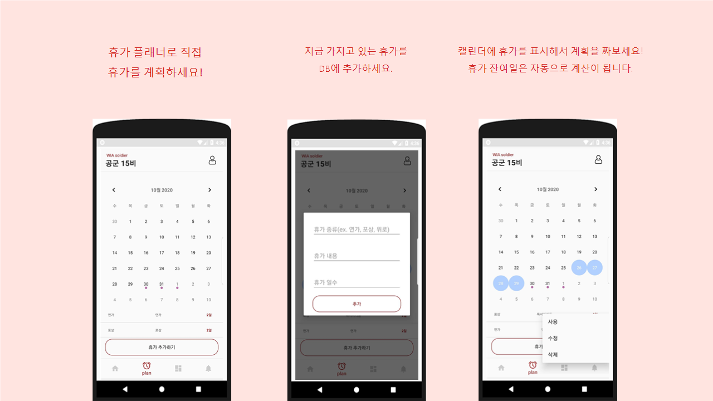

WIA는 기본적으로 휴가 플래너 기능을 탑재하고 있습니다. 사용자는 휴가 종류와 일수를 기록한뒤, 캘린더에 체크하여 자신의 휴가를 계획할 수 있습니다. 캘린더에 '휴가'라고 표시하면
자동으로 해당 항목의 휴가 갯수가 줄어들어, 캘린더에 표시만 해도 현재 몇개의 휴가가 남았는지 자동으로 계산됩니다.

---

### 알림 기능

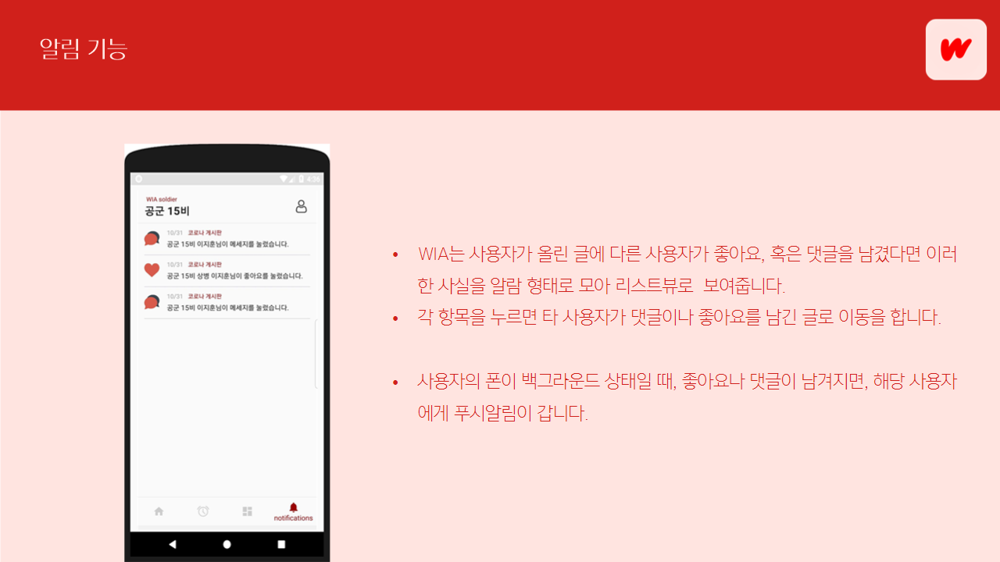

WIA는 사용자들이 서로 좋아요나 댓글을 남겼을 때, 서로에게 알림이 가도록 푸시 알림과, 앱 자체 알림 기능이 구현되어 있습니다. 특히, 사용자의 알림 정보를
모아서 리스트뷰로 보여주는데, 각 리스트뷰의 항목을 누르면 해당 알림이 발생한 게시물로 이동됩니다. 만약 게시물이 이미 삭제가 되었다면 '게시물이 삭제되었습니다'라는
토스트 메세지를 출력시킵니다.

---

### 그 외 기능들

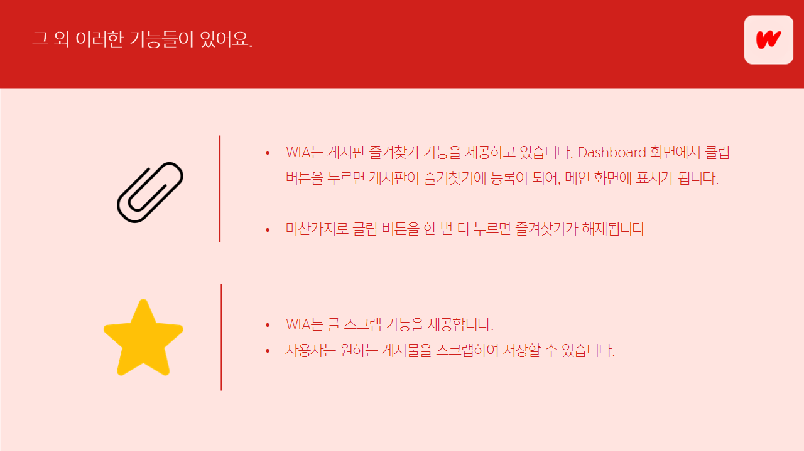

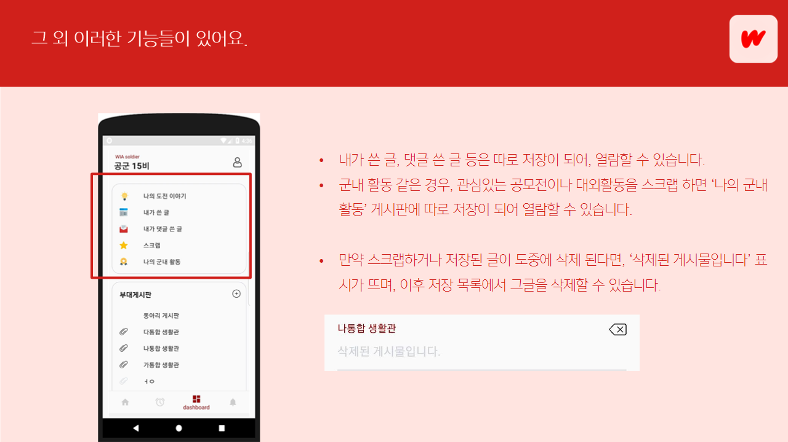

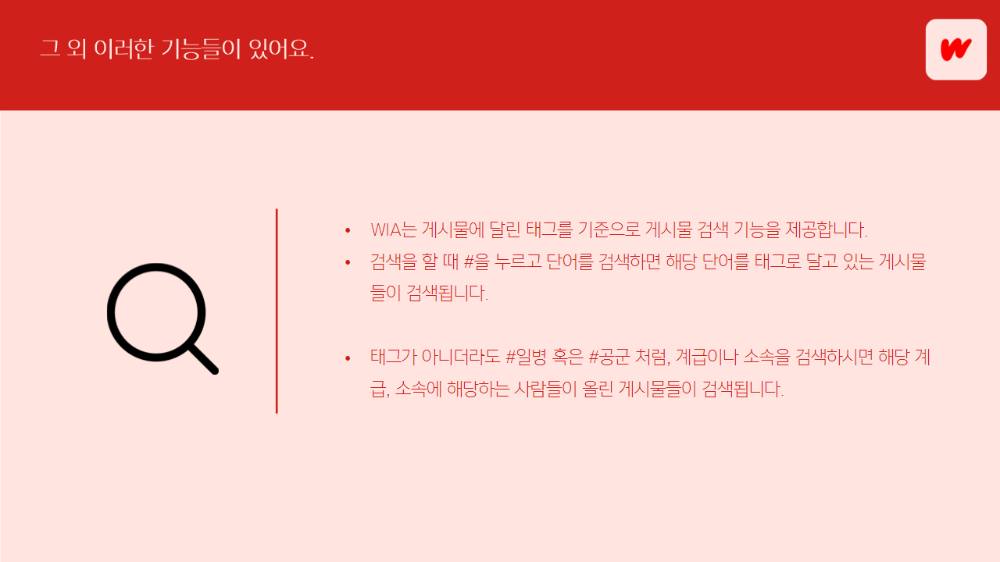

---

### 이런건 좀 문제가 될 수 있을 것 같아요!

**Q : 군인들을 위한 SNS를 서비스 하면 군보안에 문제가 생길 수 있지 않을 까요?**

* SNS가 활발한 의사소통을 목적으로 하는 서비스인 만큼, 보안과 관련하여 우려되는 것은 사실입니다. 그러나 WIA 서비스가 아니더라도, 부대내 병사들의 핸드폰 사용이
허가된 시점부터, 병사들은 지금도 부대 내에서 타 SNS를 활발히 사용하고 있는 중입니다. 인스타, 페북 같은 SNS를 이미 많은 병사가 사용하고 있는 시점에서,
WIA 서비스가 도입 하나만으로 위혐요소가 되지는 않을 것입니다.

* 4차 산업혁명이 도래한 지금, 군 보안에 민감한 군부대 까지 인터넷 커뮤니티의 문화가 자리잡고자 하는 현상은 어쩌면 자연스러운 것일지도 모릅니다. 무턱대고 SNS 문화를
금지시키는 것 보다, 더욱 중요한 것은 엄중한 군인의 무게를 느끼며, 철저한 보안 의식과 함께 병사 한명 한명이 스스로 더욱 조심하는 정신 보안의 자세를 갖추는 것이라고 할 수 있겠습니다.

**Q : 활발한 교류 속에서 발생하는 타인에 대한 비하, 폭언, 욕설 등으로 오히려 병사들의 정신건강에 부정적인 영향을 끼치지는 않을까요?**

* 답변으로 앞에서도 잠깐 언급했던 공군 인트라넷 문학 카페 '휴머니스트'를 예시로 들겠습니다. 휴머니스트는 공군이 가장 많이 사용하는 커뮤니티 이지만
관리자의 엄격한 규제와, 사용자들의 높은 예절 수준으로 지금까지도 건전한 커뮤니티 활동을 이어나가고 있습니다. WIA 또한 병사 SNS 사용 수칙을 재차 강조하거나,
수위 높은 글은 엄격히 규제하는 등, 건강한 커뮤니티 문화를 위해 지속적으로 관리한다면 위의 우려 사항은 자연스레 사라질 것이라고 믿습니다.

## 기능 설계

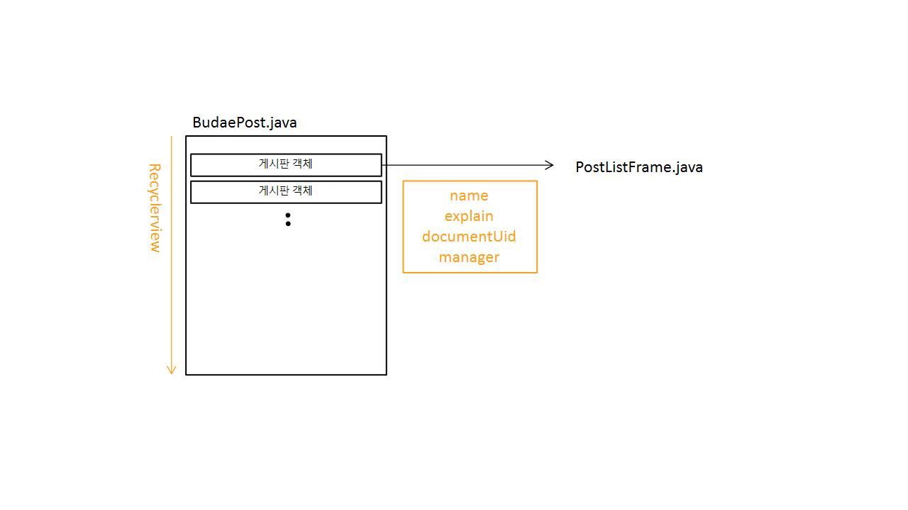 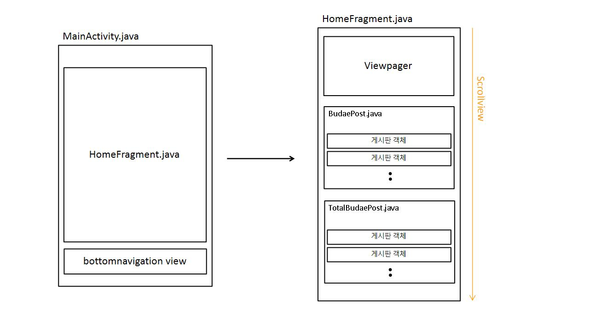
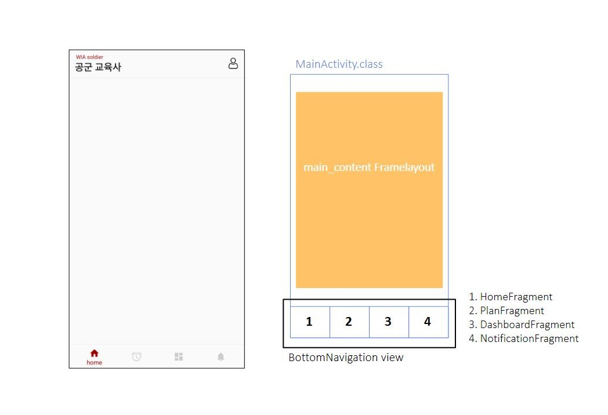 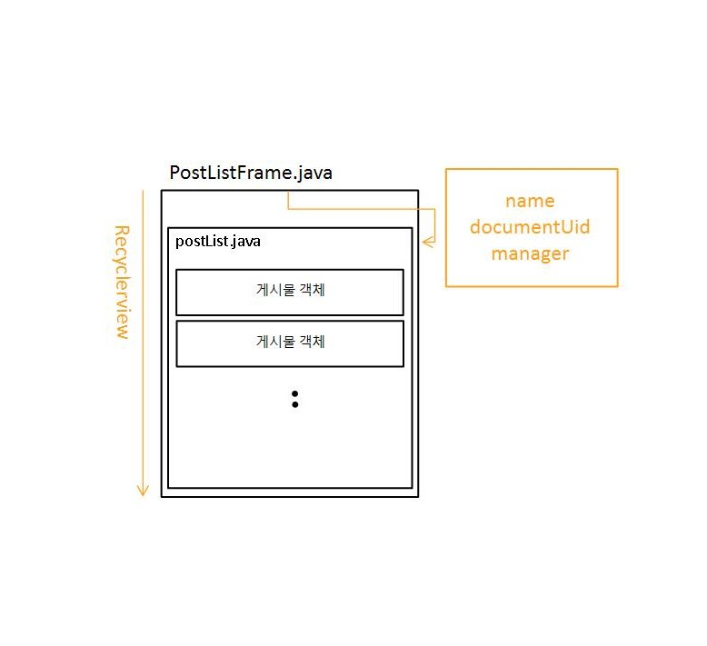

## 컴퓨터 구성 / 필수 조건 안내 (Prerequisites)
* 안드로이드 6.0 이상

## 기술 스택 (Technique Used)

WIA 개발에 관한 기술 스택은 다음 링크에서 자세히 확인하실 수 있습니다.

▶ [WIA API 개발 문서](https://github.com/osamhack2020/APP_WIA_ONANDON/blob/master/API.md)

## 설치 안내 (Installation Process)
apk 파일은 다음 링크에서 다운 받으실 수 있습니다.

▶ [WIA_APK](https://drive.google.com/file/d/1Gnh0D9wMeFHjL6GYblZzgit8e7dgSiWc/view?usp=sharing)

## 프로젝트 사용법 (Getting Started)

아래의 테스트 계정으로 자유롭게 로그인 하시어 사용하시면 되겠습니다. 단, 부대마다 각각 다른 커뮤니티를 제공하는 WIA의 특성 상
저희 팀원들이 모든 부대 커뮤니티를 예시자료로 만들기에는 한계가 있어, 2개의 부대에 속한 병사들의 가상 계정을 제공해 드리는 점
양해 부탁드립니다.

#### 관리자 계정 1

* ID : manager@naver.com
* pass : manager
* 공군 15비 일병 이승준

#### 관리자 계정 2

* ID : manageredu@naver.com
* pass : managerEdu
* 공군 교육사 일병 이승준

#### 일반 계정 1

* ID : user1@naver.com
* pass : user1user1
* 공군 15비 상병 이지훈

#### 일반 계정 2

* ID : user2@naver.com
* pass : user2user2
* 공군 교육사 병장 정진우

**계정을 바꿔가며 테스트 하고 싶으시다면, 아래 이미지를 참고하여 로그 아웃을 하신 후, 계정을 바꾸시면 되겠습니다.**

## 역할 분배

#### 이승준(팀장)

* 백엔드 개발 및 firebase로 서버, DB 구조 디자인
* WIA 서비스 기획 및 XML 코드를 통한 UI 디자인
* 발표자료 제작 및 시연 영상 제작

#### 홍수성

* planFrament.java 구현 부분 및, 휴가 플래너 개발
* API 개발 문서 보안 및 코드 주석 처리
 
## 팀 정보 (Team Information)
- 이승준 (9penguin9@naver.com), Github Id: 0nandon
- 홍수성 (joseph1999@naver.com), Github Id: PnDong

## 저작권 및 사용권 정보 (Copyleft / End User License)
 * [MIT](https://github.com/osam2020-WEB/Sample-ProjectName-TeamName/blob/master/license.md)
